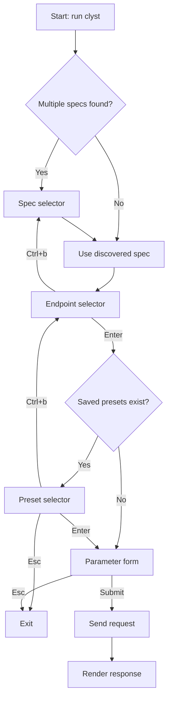

# Clyst

A small TUI (terminal UI) client for exploring an OpenAPI spec and sending HTTP requests. Point it at an OpenAPI 3 spec file, pick an endpoint, fill parameters/body in a form, and view the response — all from your terminal.


## Features

- Endpoint picker: browse `paths` and methods from your spec.
- Parameter form: enter path and query parameters; optional request body editor.
- Request/response viewer: sends the request and renders status, headers, and JSON body.
- `$ref` support (local): resolves `#/components/parameters/*` and `#/components/requestBodies/*`.
- Spec discovery: automatically finds a spec file in the current directory.
- Parameter presets: record form inputs (Ctrl+R) and reuse them per endpoint.

## Installation

- With Go (recommended):
  - `go install github.com/atolix/clyst@latest`
- From source:
  - `git clone https://github.com/atolix/clyst`
  - `cd clyst && go build -o clyst`
- Pre-built binaries:
  - `make build` → writes `dist/clyst` (or `.exe` on Windows)
  - `make build-all` → writes per-platform archives under `dist/`

Requires Go 1.23+ to build from source.

## Quick Start

1) Place an OpenAPI 3 spec in your project root. Clyst looks for these names by default:
   - `api_spec.yml`, `spec.yml`, `openapi.yml`, `openapi.yaml`

2) Or create `.clyst.yml` to specify files/patterns(recommended):

```yaml
spec_files:
  - api_spec.yml
  - docs/**/*.yaml
```

3) Make sure your spec provides a base URL (Clyst reads `baseUrl`):

```yaml
openapi: 3.0.0
baseUrl: https://api.example.com
paths:
  /users/{id}:
    get:
      summary: Get user
      parameters:
        - name: id
          in: path
          required: true
          schema:
            type: integer
      responses:
        "200": { description: OK }
```

4) Run Clyst:

- If installed: `clyst`
- From the repo: `go run .`

Pick an endpoint, fill values, and submit. The response is shown with basic formatting.

## Using $ref

Clyst resolves local `$ref` for parameters and request bodies:

```yaml
paths:
  /users:
    get:
      parameters:
        - $ref: '#/components/parameters/Limit'
    post:
      requestBody:
        $ref: '#/components/requestBodies/NewUser'

components:
  parameters:
    Limit:
      name: limit
      in: query
      required: false
      schema: { type: integer }
  requestBodies:
    NewUser:
      content:
        application/json:
          schema:
            type: object
            required: [name, email]
            properties:
              name: { type: string }
              email: { type: string }
```

Supported `$ref` kinds:
- `#/components/parameters/<Name>`
- `#/components/requestBodies/<Name>`

External files (`$ref: ./file.yml#/...`) and `$ref` inside schema objects are not yet supported.

## TUI Controls

- Tab/Shift+Tab: move
- Enter: submit (newline in Body)
- Ctrl+s: submit
- Ctrl+r: toggle recording presets
- Ctrl+b: go back during preset selection
- Esc: cancel

## Flow Overview



## Limitations (Current)

- Parameters: path and query are supported. Header and cookie parameters are ignored at request time.
- Body: free-form text area. If non-empty, `Content-Type: application/json` is set automatically.
- `$ref`: only local refs to `components.parameters` and `components.requestBodies` are resolved.
- Servers: the spec’s `servers` section is ignored; use top-level `base_url`.

## Development

- Run locally: `go run .`
- Build: `go build -o clyst`
- Binary builds: `make build` or `make build-all`
- Lint/format: use your preferred Go tools; no specific config is included.

Project structure highlights:
- `spec/`: spec discovery and loader (`$ref` resolution lives here)
- `tui/`: terminal UI for endpoint selection and parameter input
- `request/`: request assembly and sending
- `output/`: response rendering

## Contributing

Issues and PRs are welcome at https://github.com/atolix/clyst.

## License

See `LICENSE` for details.
